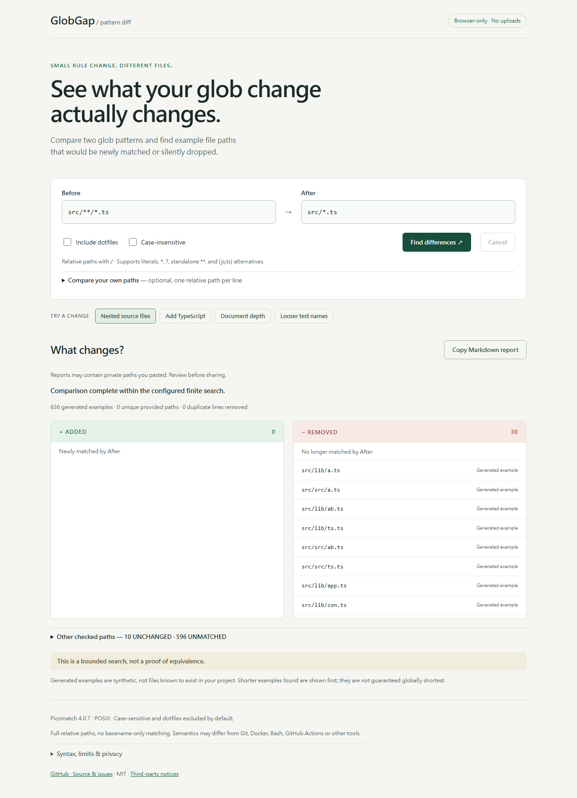

# GlobGap

**See what your glob change actually changes.**

Compare two glob patterns and find example file paths that would be newly matched or silently dropped.

[GitHub source](https://github.com/billy30183-rgb/globgap) · [Live demo — initial deployment pending](https://billy30183-rgb.github.io/globgap/)

You can also run `npm ci && npm run dev` and open [the local demo](http://127.0.0.1:4173/globgap/).



Change `src/**/*.ts` to `src/*.ts`:

| Example path | Result |
| --- | --- |
| `src/main.ts` | UNCHANGED — both match |
| `src/lib/util.ts` | REMOVED — only Before matches |

Unlike a typical glob tester, GlobGap focuses on **comparing a change**, actively generating difference examples, and copying a Markdown review report. You can start without a file list, or paste your own relative paths to check their actual matching differences.

## Use it

1. Enter Before and After. Both use the same options.
2. Optionally enable **Include dotfiles** or **Case-insensitive**.
3. Optionally expand **Compare your own paths** and paste one relative path per line.
4. Select **Find differences**. ADDED and REMOVED are shown first; expand the other results for UNCHANGED and UNMATCHED.
5. Select **Copy Markdown report**. Review pasted private paths before sharing. If clipboard access is unavailable, a selectable report preview appears.

Generated examples are synthetic paths, not files known to exist in your project. Provided paths are explicitly labelled. Duplicate provided lines are counted once, with a duplicate count; a path appearing in both sources retains both labels. Counts refer to checked source/path records, never an entire project's file count.

Four built-in examples cover nested source files, adding TypeScript, document depth and looser test names. Fixed links such as `#demo=nested` select a synthetic example. Your inputs are never added to URLs.

## Local development

Node.js 22 or newer; npm. No backend, API key or account is needed to use the app.

```sh
npm ci
npm test
npm run build
npm run dev
```

Open http://127.0.0.1:4173/globgap/. The development server serves the built site; restart `npm run dev` after source edits. `dist/` is the complete static deployment artifact and can be hosted at a root or subpath.

For the small real-browser suite:

```sh
npx playwright install chromium
npm run test:browser
```

On Linux CI, use `npx playwright install --with-deps chromium`. Tests use Node's built-in `node:test` and Playwright Chromium. They cover the four demonstrations, independent engine classification invariants, novel literal vocabulary, validation/limits, Unicode/spaces, Markdown escaping, Worker cancellation/timeouts/stale results, offline analysis, clipboard content, mobile layout, and a `/globgap/` deployment base. The screenshot above is captured by the browser suite from the real app, not an illustration.

## Syntax and engine

Runtime dependency: **Picomatch 4.0.7**, pinned with a committed lockfile. Node tests and browser Workers share `src/compare.js` and `picomatch/posix.js`. Picomatch's POSIX entry avoids Node OS/path dependencies; no browser compatibility shims are needed. esbuild embeds the bundled Worker source as a string; a Blob Worker can be terminated and restarted without fetching code again. This does not use `eval` or `new Function`.

Supported:

- Literal relative paths, including spaces and Unicode.
- `*`, `?` and `**` as an entire path segment.
- Non-nested, nonempty comma-separated brace alternatives, such as `*.{js,ts}`.

Not supported (explicit errors): negation `!`, extglobs or parentheses, character classes/ranges `[a-z]`, nested braces, brace ranges, backslash escapes, multiline include/exclude rules, and configuration imports. Use `/` separators. Absolute/drive-qualified paths, empty paths, control characters, empty segments, `.`/`..` segments and trailing slashes are rejected. Paths are never trimmed or silently rewritten. LF and CRLF are accepted; one terminal newline is a line terminator, while internal blank lines are errors. Length limits count JavaScript UTF-16 code units.

Restricted brace alternatives are expanded before matching; literal regex/quote punctuation is escaped so it cannot opt into additional syntax. Every candidate is then checked by the real Picomatch engine, never classified by generation heuristics.

Options (shown in the UI and every report):

```json
{"dot":false,"nocase":false,"basename":false,"windows":false,"nonegate":true,"noext":true,"nobrace":true,"regex":false,"keepQuotes":true,"strictSlashes":true,"fastpaths":false}
```

Only `dot` and `nocase` are user-configurable. Matching is case-sensitive by default, dotfiles are excluded unless explicitly matched, and full relative paths are compared. Picomatch semantics are **not guaranteed to match Git, Docker, Bash, GitHub Actions or other tools**. `?` follows this engine's character semantics, including its treatment of UTF-16 surrogate pairs.

## Bounded examples, not a proof

The deterministic generator extracts literal folders, filename fragments, extensions and brace branches from both rules. It synthesizes different wildcard lengths, zero/one/multiple directory depths, extension variations, dot-prefixed segments, case variants and a small boundary vocabulary, then deduplicates. Individual wildcard mutations supplement uniform substitutions. All candidates are checked against both matchers. Results are sorted by path length, then stable code-unit order.

| Limit | Maximum |
| --- | --- |
| Pattern length | 256 |
| Path length | 512 |
| Provided lines, including duplicates | 2,000 |
| Generated candidates | 3,000 |
| Brace combinations per pattern | 64 |
| Wildcard tokens per pattern | 16 |
| Worker deadline | 4 seconds |

Reaching the candidate limit or omitting generated paths longer than 512 characters explicitly marks results incomplete. Enumeration stops when the candidate budget is exhausted. Oversized user inputs are rejected, not silently truncated. Cancel, timeout, or changed input terminates the Worker and discards its results; no partial report is presented as complete. The same inputs/options/version/budget produce the same candidates and order when allowed to finish; actual timeout timing depends on the device.

No differences means only: **“No differences found among the checked paths.”**

**This is a bounded search, not a proof of equivalence.** The tool can miss differences. It finds shorter examples within its search, not guaranteed globally shortest counterexamples. It is a rule comparison aid, not a security certification tool. Reports retain both patterns, the exact engine/options, counts, all checked source-labelled paths and these limits. Markdown-sensitive characters are encoded to prevent path text from changing report structure or becoming HTML.

## Privacy

Analysis runs in your browser. The app does not upload patterns, paths or results; call models; scan your computer; open paths; read file contents; log inputs to the console; save inputs to localStorage; or use telemetry, CDN scripts or third-party fonts. After resources load, comparisons can run offline. Copying a report is an explicit export and may include private paths you pasted.

Visiting a hosted site still makes normal resource requests and may create hosting logs. Browser extensions, the system clipboard and any service where you choose to share a report are outside this app's control.

## Contributing and publication

Found a surprising pattern pair? Please [open an issue](https://github.com/billy30183-rgb/globgap/issues) with both patterns and a minimal example path. Include the selected options and engine version; avoid posting private paths. For local changes, run both test commands before submitting a PR.

See [publishing instructions](docs/PUBLISHING.md) for safe repository/Pages/release setup. The project has no npm package release.

## License

[MIT](LICENSE). Picomatch's MIT license and development dependency acknowledgements are retained in [third-party notices](THIRD_PARTY_NOTICES.md).
